<!-- SEO Meta -->
<!-- title: Awesome AI-Native Law Firms | Best AI Legal Tech SaaS & Open-Source Tools 2026 -->
<!-- description: Curated list of the best AI-native law firms, legal AI SaaS platforms, and open-source legal tech tools. Includes pricing, company size, GitHub stars, and more. Updated 2026. -->
<!-- keywords: AI law firm, legal AI, legal tech, LegalOS, Harvey AI, AI contract review, open source legal, LangChain legal, AI legal research, automated law firm, legal automation, SaaS legal tools -->

  

  
  
  
  
  
  
  

# ⚖️ Awesome AI-Native Law Firms

## 🚀 Top AI Native Law Firms Ecosystem

**📋 Curated List of SaaS Products & Open-Source GitHub Projects**
*🎯 Focused on AI-First Legal Practices, Legal Tech & Automated Law Firms*
**🗓️ Last updated: July 2026**

This repository tracks notable **SaaS platforms** and **open-source projects** building **AI Native Law Firms**. These organizations and tools leverage AI for legal research, document drafting, contract analysis, compliance, case prediction, and client services — reimagining traditional legal practice from the ground up.

**🌟 Examples** include Norm Law, Eudia Counsel, Crosby, General Legal, LegalOS, Moritz, Vector Legal, Arcline, and Reigns LLP (the category leaders). Tools listed here emphasize **AI-first workflows**, automation, scalability, and modern legal service delivery.

**💡 Open-source emphasis**: This section is heavily expanded with every major active project for self-hosting, local LLMs (Ollama), full customization, and open legal tech development — ideal for lawyers, legal tech builders, and organizations seeking transparent and sovereign legal AI tools.

> 💬 Contributions welcome! Open a PR to add/update entries. Keep descriptions factual and link to official sites.

---

## 📚 Table of Contents

- [⚖️ SaaS Products](#️-saas-products)
- [🔓 Open-Source GitHub Projects](#-open-source-github-projects)
- [🤝 How to Contribute](#-how-to-contribute)
- [⚠️ Disclaimer](#️-disclaimer)

---

## ⚖️ SaaS Products

### 🏛️ Core Platforms — AI Native Law Firms

> 📊 Sorted by **company size** (valuation / total funding raised), **descending**. Data sourced from public filings, Crunchbase, and news reports as of July 2026.

| 🏢 Product | 📝 Description | 💰 Pricing | 📊 Company Size |
|:-----------|:---------------|:-----------|:----------------|
| 🥇 **[Norm Law](https://normlaw.ai/)** | Forward-thinking AI legal practice (backed by Norm Ai) specializing in technology, innovation, and global institutional clients with fully AI-augmented legal workflows. | Contact for pricing (Enterprise) | **$1.2B valuation** · Series C $120M (Jul 2026) · Total raised >$260M |
| 🥈 **[Eudia Counsel](https://eudia.ai/)** | World's first AI-augmented law firm operating under Arizona's ABS program; AI-powered legal counsel platform for businesses and individuals, backed by General Catalyst. | Contact for pricing (Enterprise) | **~$450M est. valuation** · $105M Series A (Feb 2025) · Led by General Catalyst |
| 🥉 **[Crosby](https://crosby.legal/)** | AI-first "neofirm" delivering fast, flat-fee contract reviews for high-growth tech startups (clients: Ramp, Cursor, Cognition). Multi-agent AI + attorney oversight. | ~$400/contract flat-fee · Contact for enterprise quote | **~$400M valuation** · $85.8M total raised · Series B $60M (Mar 2026, Lux Capital + Index) |
| 4️⃣ **[General Legal](https://generallaw.ai/)** | Modern AI-first legal practice for growth-stage startups — automated commercial contracts (NDAs, MSAs, DPAs) with flat-fee pricing and fast turnarounds. | **$500/contract** (flat-fee) · No free tier | **$11.5M Seed/Pre-Seed** (Mar 2026) · YC W26 |
| 5️⃣ **[LegalOS](https://legalos.ai/)** | AI-powered legal operating system and practice platform. Specializes in immigration law with AI-driven case management and compliance automation. | Per-seat or enterprise quotes · Contact for pricing | **$10M Series A** (2025) · YC W26 |
| 6️⃣ **[Moritz](https://moritz.legal/)** | Innovative AI-native law firm for complex cross-border transactions; proprietary AI automates ~80% of legal work, attorneys finalize remaining 20%. Flat, upfront quotes. | Flat-fee quotes per matter · No free tier | **$9M Seed** (May 2026) · YC W26 · Backed by Parlai |
| 7️⃣ **[Vector Legal](https://vectorlegal.com/)** | AI-native law firm leveraging VectorOS™ platform for startup legal services (fundraising, corporate/commercial). Efficient, scalable, and AI-augmented delivery. | Custom/startup-friendly pricing · Contact for quote | **$61M raised** · YC W26 · Seed stage |
| 8️⃣ **[Arcline](https://arcline.ai/)** | AI-driven legal services firm with focus on workflow automation and operational efficiency for modern legal teams. | Contact for pricing | **Early-stage / Stealth** |
| 9️⃣ **[Reigns LLP](https://reignsllp.com/)** | AI-native law firm combining deep legal expertise with advanced automation and AI-augmented legal delivery. | Contact for pricing | **Early-stage** |

### 🔬 Advanced & Specialized Platforms

> 💡 **Other notable mentions**: Various AI legal tech startups and virtual law firms are emerging rapidly in this space, including Harvey AI ($11B valuation), Ironclad, Spellbook, and more.

---

## 🔓 Open-Source GitHub Projects

### 🛠️ Dedicated AI Legal Tech & Open Law Firm Tools

> Sorted by ⭐ GitHub Stars (descending). Badges link to stargazers pages.

-  **[LangChain Legal Agents](https://github.com/langchain-ai/langchain)**
  The backbone framework for building AI legal assistants — powers document Q&A, contract summarization, retrieval-augmented legal research, and multi-step reasoning pipelines.

-  **[CrewAI Legal Crews](https://github.com/crewAIInc/crewAI)**
  Multi-agent orchestration framework for building collaborative legal AI teams (legal researcher, contract drafter, compliance auditor agents working in parallel).

-  **[LlamaIndex Legal RAG](https://github.com/run-llama/llama_index)**
  Data framework for building legal knowledge bases and retrieval-augmented generation (RAG) systems; enables context-aware case law retrieval and legal document analysis over large corpora.

-  **[DocTR Legal](https://github.com/mindee/doctr)**
  Open-source deep learning document text recognition (OCR) toolkit; widely used in legal tech to digitize scanned contracts, court filings, and evidence documents for automated review.

-  **[OSCAL](https://github.com/usnistgov/OSCAL)** *(and related compliance tools)*
  Open Security Controls Assessment Language — open-source NIST framework for standardized, machine-readable regulatory compliance and legal automation, mapping legal mandates to IT controls.

- **[Open Legal AI](https://github.com/search?q=open+legal+ai)**
  Community-driven open-source legal AI tools and frameworks for document analysis and automation.

- **[LawLLM / Legal AI Models](https://github.com/search?q=law+llm+open+source)**
  Open-source legal language models and fine-tunes for contract review, legal research, and drafting.

- **[Harvey AI Open Alternatives](https://github.com/search?q=harvey+ai+open+source)**
  Community reproductions and alternatives to AI legal research and analysis tools.

- **[Legal Robot Open Implementations](https://github.com/search?q=legal+robot+open+source)**
  Open-source tools for contract analysis and legal document processing.

- **[Open Source Legal Tech](https://github.com/search?q=open+source+legal+tech)**
  Various repositories for open legal document automation and practice management.

### 🔧 Additional Strong Open-Source Options

- 📄 **[PDFPlumber / PyMuPDF](https://github.com/jsvine/pdfplumber)** — Legal document parsing and extraction from PDFs.
- 🏷️ **[spaCy + Legal NER](https://spacy.io/)** — Named entity recognition in contracts and legal documents.
- 🤗 **[Hugging Face Legal Models](https://huggingface.co/models?search=legal)** — Various open legal LLMs and fine-tuned models.
- ⚙️ **[n8n Legal Workflows](https://github.com/n8n-io/n8n)** — Automated document processing and compliance checks.
- 🧠 **[Dify Legal Agents](https://github.com/langgenius/dify)** — Building custom legal AI applications with visual tooling.

> 💡 **Build your own sovereign legal AI**: Combine **LangChain** + **LlamaIndex** + **CrewAI** + **DocTR** with **[Ollama](https://ollama.ai)** for a fully open, self-hosted legal AI stack.

---

## 🤝 How to Contribute

1. 🍴 Fork the repo.
2. ✏️ Add/edit entries in `README.md` (follow existing format).
3. 📌 Include: name, link, 1–2 sentence description, pricing info, company size, and whether it's SaaS or open-source.
4. 🔄 Submit PR with a short explanation.

⭐ **Star the repo if you find it useful!**

---

## ⚠️ Disclaimer

- 📌 This is a **community-curated** list — not exhaustive and not an endorsement.
- 🏛️ AI legal tools are **not substitutes for licensed legal advice**. Always consult qualified attorneys for legal matters.
- 🔒 Self-hosted open-source solutions require proper security and compliance with legal standards.
- 💰 Pricing and company size data reflects publicly available information as of July 2026 and may change.

---

  <strong>🤖 Made for lawyers, legal tech builders, law firms, and legal operations teams.</strong> 
  <em>Let's make legal services more intelligent, accessible, and open.</em>

<!-- 
SEO Keywords: AI native law firm, legal AI tools, legal tech SaaS, open source legal, LangChain legal, LlamaIndex legal RAG, CrewAI legal, AI contract review, Harvey AI alternative, legal document automation, AI lawyer, automated law firm 2026, LegalOS, Norm Law, Eudia Counsel, Crosby AI law, General Legal YC, Moritz legal AI, Vector Legal, AI legal research tool, legal NLP, law firm automation software
-->
